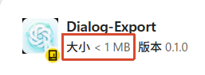
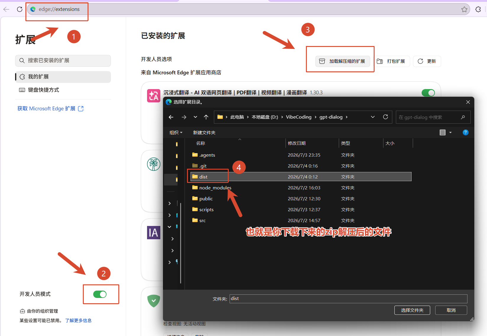

# DialogExport

DialogExport 是一个本地超轻量化 Chrome/Edge 浏览器扩展，用来把网页端 AI 对话导出为本地 Markdown、TXT 或 Word 兼容 HTML（`.doc`）文件。



## 最简单的安装方式

普通用户不需要克隆整个项目，推荐直接到 [GitHub Releases](https://github.com/Muxinlucky/DialogExport/releases/latest) 下载已经构建好的 `DialogExport-dist.zip`，也可以使用下面的命令：

```powershell
Invoke-WebRequest -Uri "https://github.com/Muxinlucky/DialogExport/releases/latest/download/DialogExport-dist.zip" -OutFile "DialogExport-dist.zip"
Expand-Archive -Path ".\DialogExport-dist.zip" -DestinationPath ".\DialogExport" -Force
```



然后在浏览器里加载：

```text
1. 打开 Chrome 或 Edge 的扩展管理页面
   Chrome: chrome://extensions
   Edge: edge://extensions

2. 打开“开发者模式”

3. 点击“加载已解压的扩展”

4. 选择解压后的 DialogExport 文件夹
   该文件夹内应直接包含 manifest.json
```

**注意：浏览器要加载的是直接包含 `manifest.json` 的文件夹，不是项目源码根目录。**

## 支持的平台

ChatGPT  Claude  Gemini  Grok  DeepSeek  Kimi 豆包（Doubao） 通义千问（Qwen）腾讯元宝（Yuanbao）

Google AI Studio 当前不支持。不同平台的网页结构会变化，请以当前版本的实际测试结果为准。

## 功能

- 支持 Markdown、TXT 和 Word 兼容 HTML（`.doc`）三种导出格式
- 导出当前 AI 对话
- 扫描并勾选要导出的历史会话
- 批量导出选中的对话，并生成成功索引和失败报告
- 支持停止批量导出任务
- 批量导出可选 ZIP 压缩包；项目会话按项目名放入子文件夹，普通会话放在压缩包根目录

批量导出使用临时的非活动标签页，不会反复切走用户当前正在使用的页面。不同平台的网页结构不同，部分平台可能只支持导出当前对话，历史扫描能力会随版本继续改进。

## 隐私说明

DialogExport 只在浏览器本地运行。扩展只在用户主动点击导出或扫描后读取必要数据，并在本地生成文件。扫描 ChatGPT 历史时，为识别未展开项目中的对话，会使用当前登录会话向 `chatgpt.com` 自身请求项目会话的标题和 ID。聊天内容和访问凭据不会上传到开发者或第三方服务器。

扫描列表和任务状态可能临时写入 `chrome.storage.session`，用于恢复 Popup 展示；浏览器会话结束后由浏览器清理。完整说明见 [PRIVACY.md](PRIVACY.md)。

## 权限说明

扩展使用以下权限：

- `scripting`：在支持的平台页面中读取可见 DOM，并在批量导出的临时标签页中注入内容脚本
- `downloads`：将生成的本地文件保存到用户下载目录
- `storage`：临时保存 Popup 和批量任务状态
- `host_permissions`：仅覆盖已支持的 AI 平台域名

扩展不申请 `<all_urls>`，也不申请 `cookies`、`history` 或 `webRequest` 权限。

仅在本地构建后，可以在 Chrome 或 Edge 的扩展开发者模式中加载：

```text
dist
```

## 发布检查

```bash
npm test
npm run build
npm run check:release
npm run release
```

运行 `npm run release` 后，`DialogExport-dist.zip` 和 `release/DialogExport-store-v<version>.zip` 都是可直接上传或解压加载的扩展包，`manifest.json` 位于 ZIP 根目录。

## 许可证

MIT，见 [LICENSE](LICENSE)。
